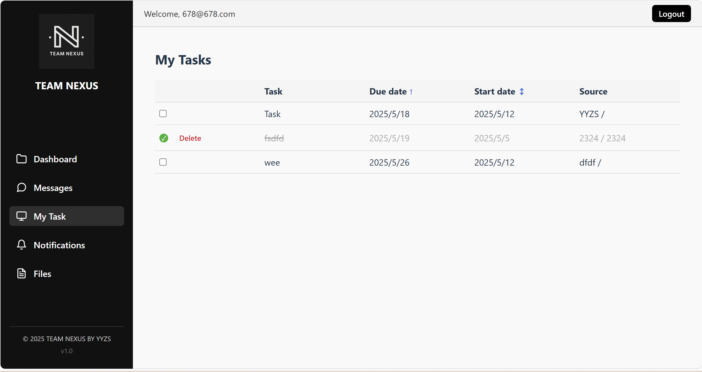
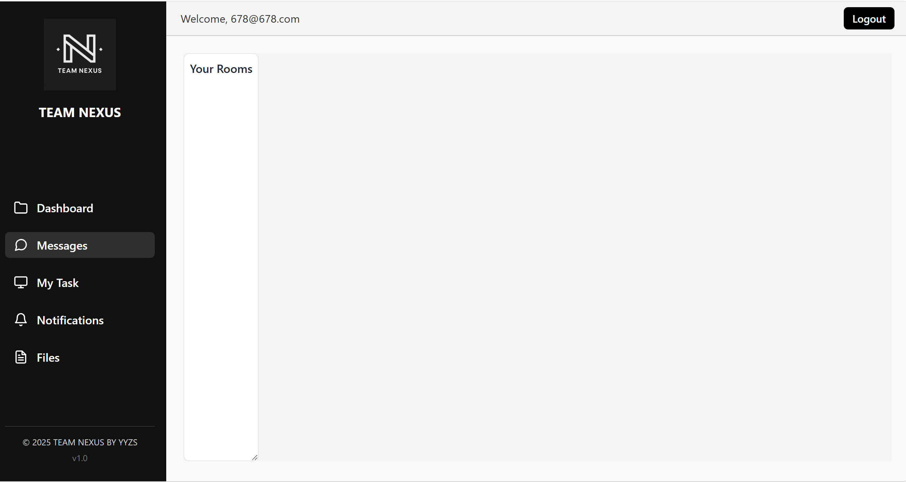
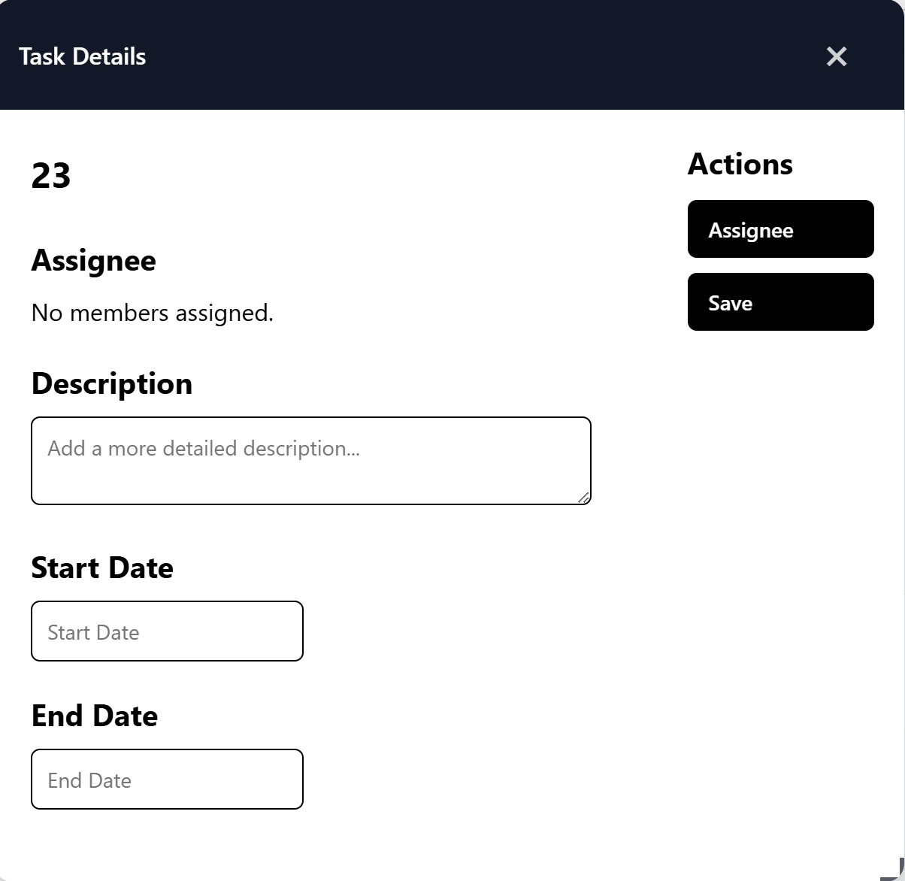
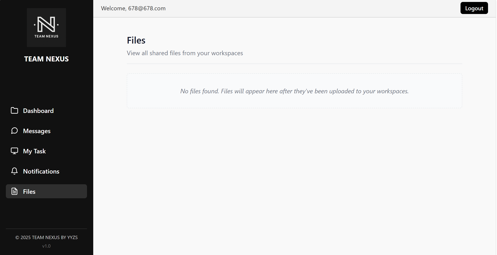
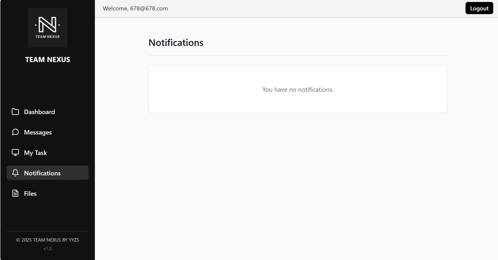
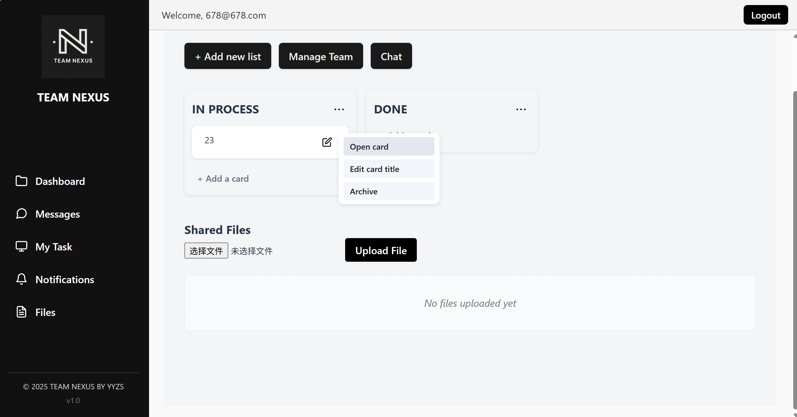

# Team Nexus 界面截图说明

本目录用于保存 Team Nexus 的主要界面截图，展示项目在工作区协作、任务管理、文件共享、通知和团队聊天等功能上的实际效果。

这些截图可用于项目展示、答辩材料、作品集说明和功能预览。

---

## 1. 工作区首页

工作区首页用于展示用户可访问的协作空间。用户可以在这里查看已有工作区，并进入对应的团队协作环境。

主要体现：

- 工作区列表展示
- 协作空间入口
- 工作区创建与管理
- 团队任务和资源的统一入口

---

## 2. Kanban 任务看板

Kanban 看板用于管理工作区内的任务流转。任务按照不同状态分布在不同列中，方便团队成员查看任务进度。

主要体现：

- 看板列管理
- 任务卡片展示
- 任务状态跟踪
- 团队协作任务流

---

## 3. 个人任务列表

个人任务列表用于集中展示当前用户相关的任务，方便用户快速查看任务来源、开始时间、截止时间和完成状态。

主要体现：

- 个人任务汇总
- 任务时间信息
- 任务来源工作区
- 任务状态查看

---

## 4. 任务详情弹窗

任务详情弹窗用于编辑和查看单个任务的完整信息，是任务协作中的核心操作界面。

主要体现：

- 任务标题和描述编辑
- 负责人分配
- 开始时间与截止时间设置
- 任务完成状态更新
- 任务协作信息维护

---

## 5. 共享文件页面

共享文件页面用于管理工作区内的团队文件和协作资源，帮助成员集中访问项目资料。

主要体现：

- 文件上传
- 文件列表展示
- 工作区资源共享
- 团队资料集中管理

---

## 6. 通知中心

通知中心用于展示任务、聊天、工作区和协作事件相关的提醒，帮助用户及时了解项目动态。

主要体现：

- 协作事件提醒
- 任务更新通知
- 消息与状态变化提示
- 通知列表管理

---

## 7. 团队聊天页面

团队聊天页面用于工作区成员之间的实时沟通，支持团队在同一协作空间中讨论任务和项目内容。

主要体现：

- 实时消息发送
- 团队沟通记录
- 工作区内成员交流
- Socket.IO 实时通信效果

---

## 截图用途

本目录中的图片主要用于说明系统功能和界面效果，不包含完整源代码或运行环境。若需要了解系统设计，请查看 [`architecture`](../architecture/README.md) 目录。
