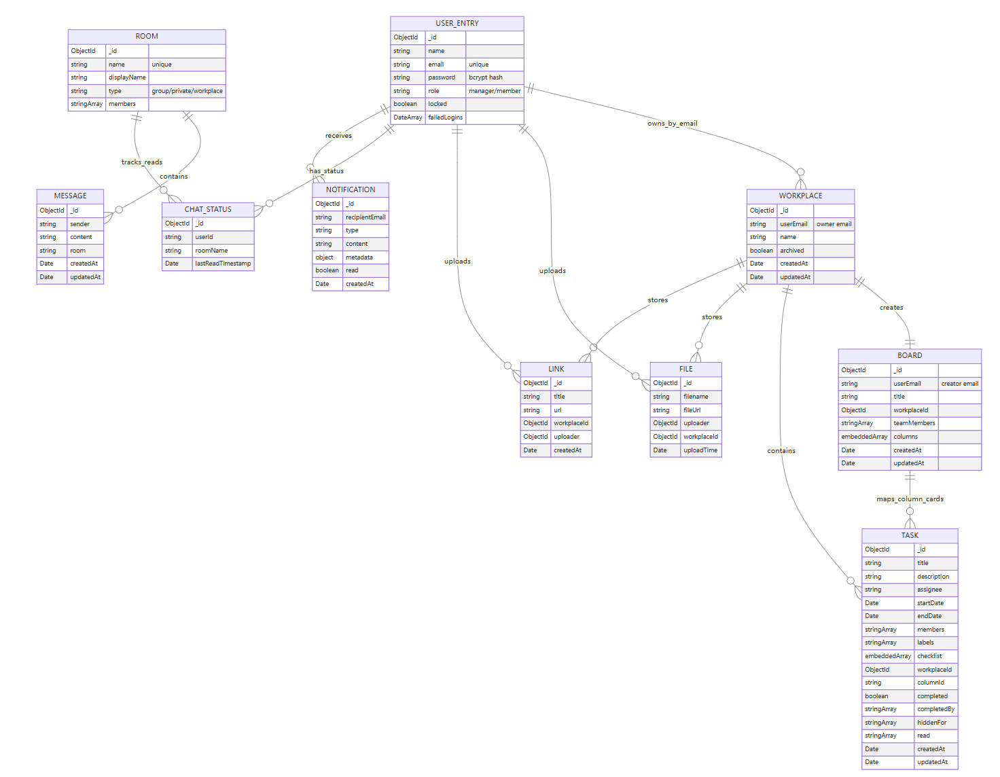
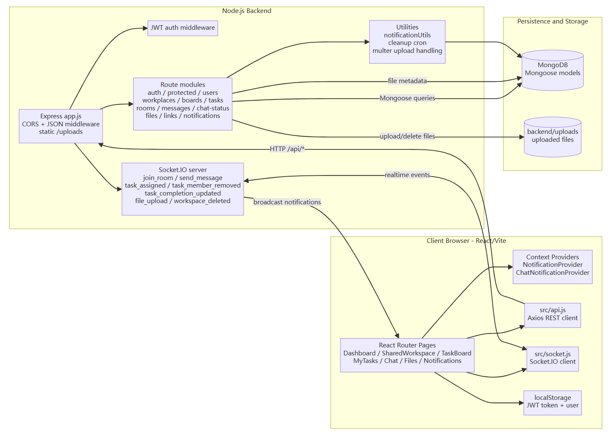

# Team Nexus 架构说明

本目录用于保存 Team Nexus 的核心架构图、数据库关系图和任务协作流程图，帮助读者理解系统的模块划分、数据关系和主要业务流转方式。

Team Nexus 是一个实时团队协作平台，支持工作区管理、Kanban 任务看板、团队聊天、通知提醒、共享文件和多人实时同步。

---

## 1. 系统架构图

该图展示 Team Nexus 的整体技术架构，主要分为前端、后端、数据库和实时通信四个部分。

### 前端部分

前端基于 React 和 Vite 构建，主要职责包括：

- 页面路由与界面渲染
- 工作区、看板、任务、聊天和通知等页面展示
- 通过 Axios 调用后端 REST API
- 通过 Socket.IO Client 接收实时事件
- 管理通知状态和聊天提醒状态

### 后端部分

后端基于 Node.js 和 Express.js 构建，主要职责包括：

- 用户登录与 JWT 认证
- REST API 路由处理
- Socket.IO 实时事件分发
- MongoDB 数据读写
- 文件上传处理
- 通知生成与广播

主要后端路由模块包括：

- `auth`：用户认证
- `protected`：受保护接口校验
- `users`：用户信息
- `workplaces`：工作区管理
- `boards`：看板管理
- `tasks`：任务管理
- `rooms`：聊天室管理
- `messages`：聊天消息
- `chat-status`：聊天未读状态
- `files`：文件上传与共享
- `links`：链接资源管理
- `notifications`：通知管理

### 实时通信

系统通过 Socket.IO 实现多人协作中的实时更新，例如：

- 新消息提醒
- 任务分配提醒
- 任务完成状态更新
- 工作区删除同步
- 通知广播

---

## 2. 数据库 ER 图

该图展示 Team Nexus 在 MongoDB 中使用的核心集合及其关系。

### 核心集合

- `USER_ENTRY`：用户信息
- `WORKPLACE`：工作区信息
- `BOARD`：看板与列结构
- `TASK`：任务详情
- `ROOM`：聊天室
- `MESSAGE`：聊天消息
- `CHAT_STATUS`：聊天未读状态
- `NOTIFICATION`：通知记录
- `LINK`：共享链接
- `FILE`：共享文件

### 主要关系

- 一个工作区可以创建或关联一个看板。
- 一个看板包含多个列和多个任务卡片。
- 一个任务可以包含负责人、标签、清单、完成状态、隐藏用户和阅读状态。
- 一个聊天室可以包含多条消息。
- 聊天状态用于记录用户的未读消息信息。
- 用户可以上传文件和链接到工作区。
- 用户可以接收任务、聊天和工作区相关通知。

该 ER 图只保留项目核心业务集合，便于展示主要数据结构，未展开所有辅助字段。

---

## 3. 任务工作流图

该图展示用户从登录到进入工作区、创建看板任务、分配任务并同步状态的完整流程。

### 主要流程

1. 用户登录系统。
2. 后端校验身份并返回 JWT。
3. 前端将 JWT 保存到 `localStorage`。
4. 用户进入工作区列表。
5. 用户创建或选择工作区。
6. 系统为工作区加载或创建看板。
7. 用户在看板中创建任务卡片。
8. 用户编辑任务详情、分配负责人、设置时间和描述。
9. 任务状态变化后，系统通过 API 保存数据。
10. Socket.IO 将任务变化同步给相关用户。

### 主要 API

- `POST /api/login`：用户登录
- `GET /api/workplaces/:email`：获取用户工作区
- `POST /api/workplaces`：创建工作区
- `GET /api/boards/:workplaceId`：获取工作区看板
- `PUT /api/boards/:workplaceId`：更新看板结构
- `POST /api/tasks`：创建任务
- `GET /api/tasks/:id`：获取任务详情
- `PUT /api/tasks/:id`：更新任务详情
- `GET /api/tasks/my`：获取个人任务

### 主要 Socket.IO 事件

- `task_assigned`：任务被分配
- `task_completion_updated`：任务完成状态更新
- `workspace_deleted`：工作区被删除
- `send_message`：发送聊天消息

---
